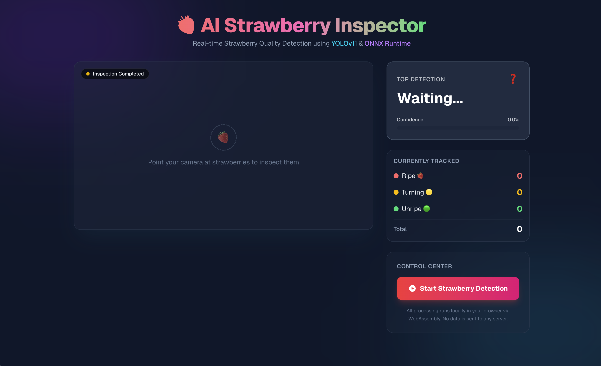

# 🍓 AI Strawberry Inspector

**AI Strawberry Inspector** เป็น Web Application สำหรับใช้ตรวจจับและวิเคราะห์คุณภาพของสตรอว์เบอร์รีแบบเรียลไทม์ผ่านกล้อง (Webcam/Mobile Camera) โดยแบ่งความสุกออกเป็น 3 ระดับ ได้แก่ **Ripe (สุก)**, **Turning (กำลังเปลี่ยนสี)**, และ **Unripe (ดิบ)** 

โปรเจกต์นี้ทำงานด้วยโมเดล AI Object Detection (YOLOv11) ซึ่งถูกประมวลผล **ภายในเบราว์เซอร์ 100% (Client-side)** ผ่าน ONNX Runtime WebAssembly ทำให้มีความปลอดภัยและเป็นส่วนตัวสูง ไม่มีการส่งภาพหรือข้อมูลใดๆ กลับไปยังเซิร์ฟเวอร์


*(ภาพประกอบ: หน้าจอสรุปผลการตรวจวิเคราะห์สตรอว์เบอร์รี)*

---

## ✨ Features (จุดเด่น)

- ⚡ **Real-time Detection:** วิเคราะห์ภาพจากกล้องสดๆ ทันที
- 🧠 **In-Browser AI Inference:** รันโมเดล YOLOv11 แบบ Local บนเครื่องผู้ใช้ผ่าน WebAssembly (WASM) 
- 🎯 **Smart Object Tracking:** มีระบบจดจำสตรอว์เบอร์รีแต่ละลูก (Centroid Tracking) ถึงแม้กล้องจะสั่นก็ไม่นับลูกซ้ำ (ป้องกันปัญหา Flickering หรือ Overcounting)
- 📊 **Session Summary:** สรุปผลการตรวจวิเคราะห์เมื่อกดหยุดกล้อง พร้อมแยกสถิติผลรวมสะสม (Total Breakdown) ว่าเจอสายพันธุ์หรือความสุกระดับไหนไปกี่ลูก
- 🤖 **AI Assessment:** ให้คำแนะนำอัตโนมัติตามสัดส่วนของสตรอว์เบอร์รีที่เจอ (เช่น "รอบนี้ส่วนใหญ่เป็นผลสุก ควรเก็บเกี่ยวอย่างระมัดระวัง")
- 🎨 **Premium UI Dark Mode:** ออกแบบอินเทอร์เฟซด้วย TailwindCSS ที่มีความทันสมัย สวยงาม ดูล้ำลึก สไตล์ Neon / Glassmorphism

---

## 🛠️ Tech Stack

- **Framework:** [Next.js](https://nextjs.org/) (React 19)
- **Styling:** [Tailwind CSS](https://tailwindcss.com/)
- **AI Model:** [YOLOv11](https://docs.ultralytics.com/) (Custom trained on Strawberry Dataset)
- **AI Runtime:** [ONNX Runtime Web](https://onnxruntime.ai/docs/tutorials/web/)
- **Language:** TypeScript 

---

## 🚀 Getting Started (วิธีการติดตั้งและรันโปรเจกต์)

### Prerequisites

โปรดตรวจสอบให้แน่ใจว่าคุณติดตั้ง Node.js เวอร์ชันล่าสุดแล้ว (แนะนำ v18+)

### 1. Clone the repository

```bash
git clone https://github.com/your-username/ai-strawberry-inspector.git
cd ai-strawberry-inspector
```

### 2. Install dependencies

```bash
npm install
# or
yarn install
# or
pnpm install
```

### 3. Run the development server

```bash
npm run dev
# or
yarn dev
# or
pnpm dev
```

เปิดเบราว์เซอร์ไปที่ [http://localhost:3000](http://localhost:3000) เพื่อเริ่มใช้งานแอปพลิเคชัน 
> 💡 *หมายเหตุ: โปรดอนุญาตการเข้าถึงกล้อง (Camera Permission) เมื่อเบราว์เซอร์ร้องขอ*

---

## 📂 Project Structure (โครงสร้างหลัก)

- `src/app/page.tsx`: หน้าจอหลัก (UI) การจัดการ State กล้อง ระบบ Object Tracking และแสดงผล Summary
- `src/app/inference.worker.ts`: (Optional) Web Worker สำหรับแยกการประมวลผลโมเดลออกจาก Main Thread เพื่อไม่ให้ UI กระตุก
- `public/models/best_3class.onnx`: ไฟล์โมเดล YOLOv11 ที่ถูกแปลงเป็น ONNX สำหรับรันบนเว็บ
- `public/models/classes.json`: ไฟล์ชื่อคลาสเป้าหมาย (`Ripe`, `Turning`, `Unripe`)

---

## 🤝 Contributing

หากสนใจพัฒนาต่อ หรือช่วยปรับปรุงความแม่นยำของโมเดล:
1. Fork repository นี้
2. สร้าง Branch ใหม่สำหรับฟีเจอร์ของคุณ (`git checkout -b feature/AmazingFeature`)
3. Commit การเปลี่ยนแปลง (`git commit -m 'Add some AmazingFeature'`)
4. Push ไปยัง Branch ดังกล่าว (`git push origin feature/AmazingFeature`)
5. เปิด Pull Request สร้างสรรค์ผลงานร่วมกัน!

---

## 📜 License

Distributed under the MIT License. See `LICENSE` for more information.
